<p align="center">
  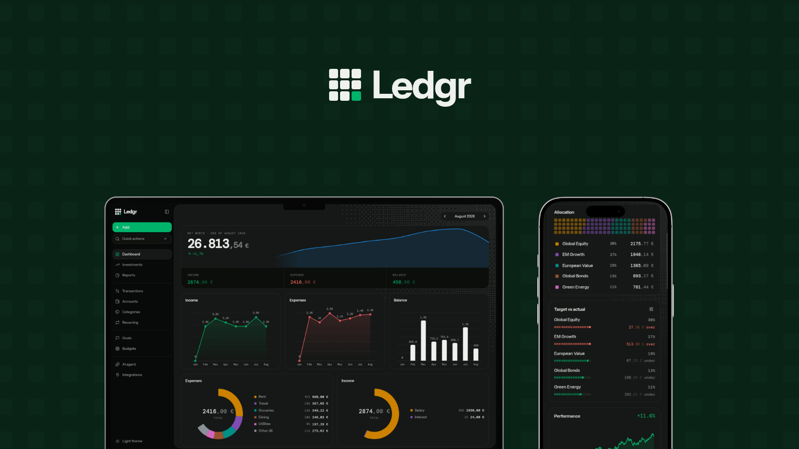
</p>

<p align="center">
  A self-hosted, opinionated expense tracker: accounts, budgets, recurring bills and an investment portfolio, running on your own.
</p>

## Self-hosted

You can run the API as a Cloudflare Worker with its own D1 database, and the frontend deployed to Cloudflare Pages, both on your account, both on the free tier. There is no login screen because there is no one to log in but you.

## Features

- **Dashboard**: net worth trend, monthly income, expense and balance charts, category breakdowns, account balances and budget status, all in one view.
- **Transactions**: a filterable table of expenses, income and transfers. 
- **Accounts**: Multi-account support. 
- **Categories**: separate expense and income lists, each with its own icon and color.
- **Budgets**: a monthly limit per category, no rollover, no month picker.
- **Recurring**: subscriptions and fixed income or expenses on a schedule. 
- **Investments**: upload a broker's order history and get time-weighted performance chart, monthly contributions, total gain, max drawdown, Sharpe ratio, detailed entries and price evolution, etc.


## Screenshots

**Dashboard**
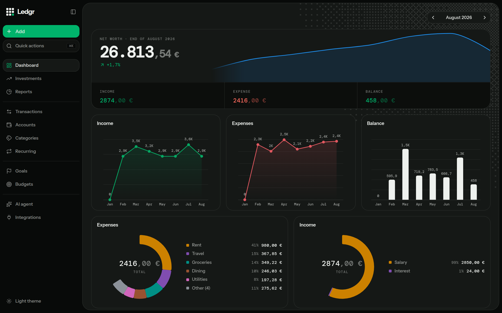

**Dashboard, balances and budgets**
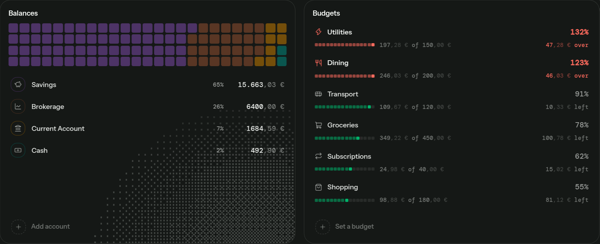

**Investments**
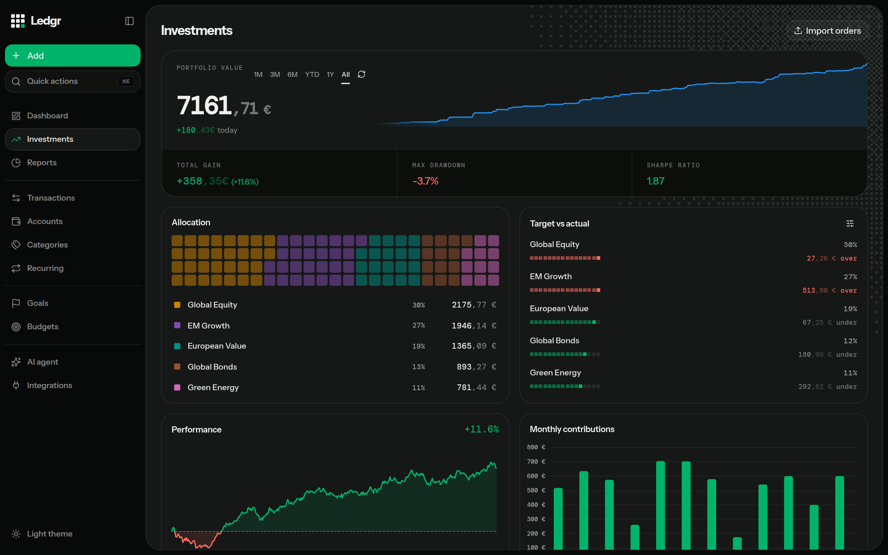

**Investments, asset price with buy markers**
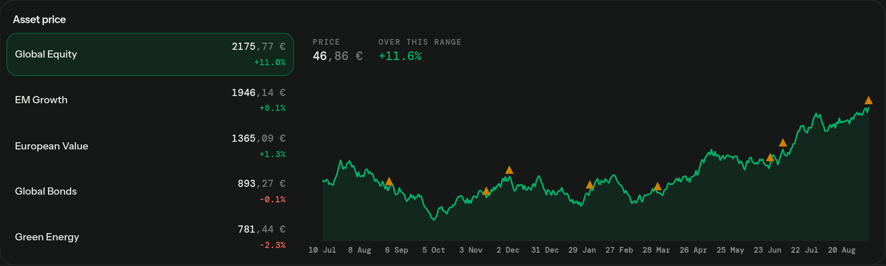

**Investments, order history**
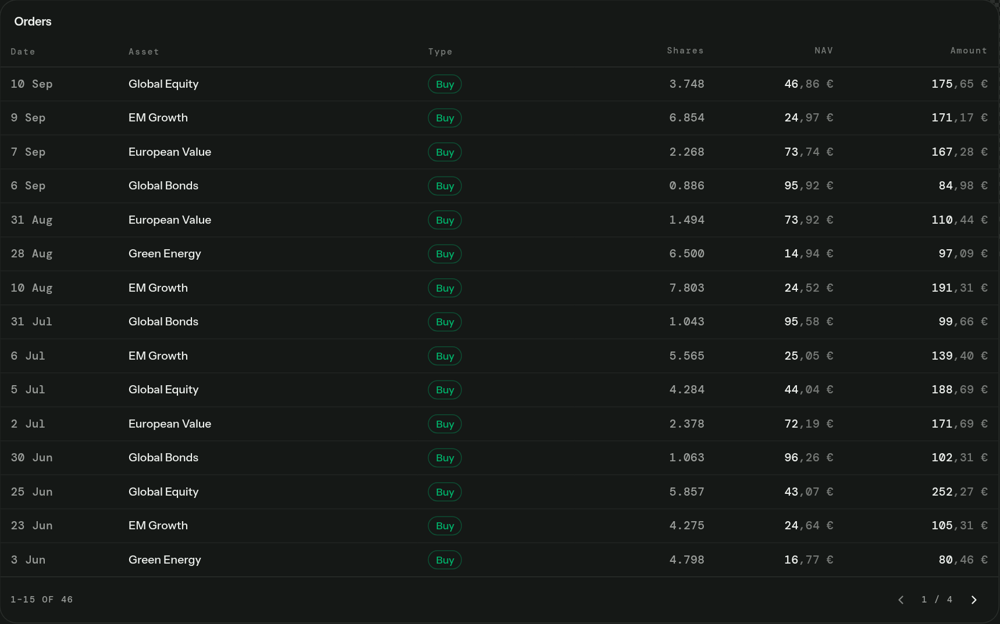

**Transactions**
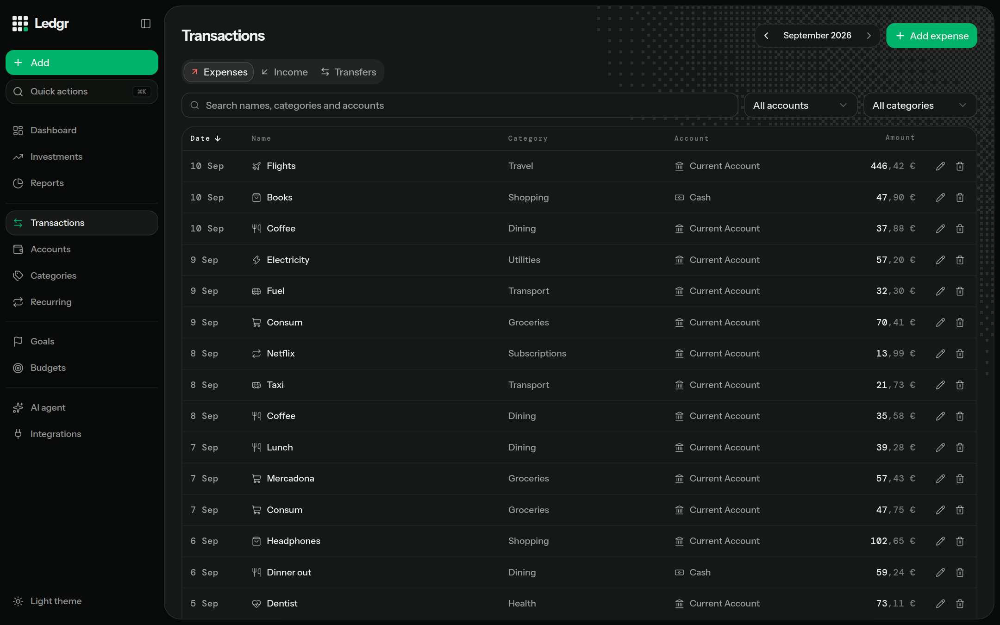

**Recurring**
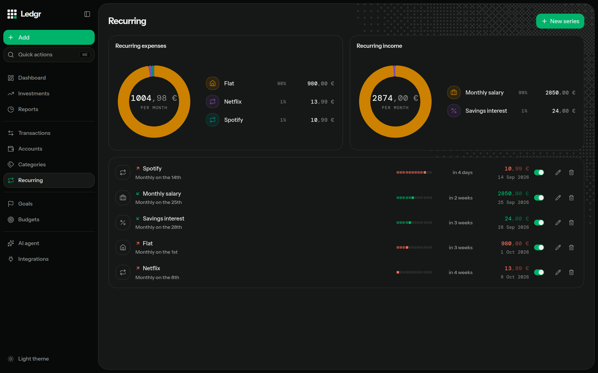

**Budgets**
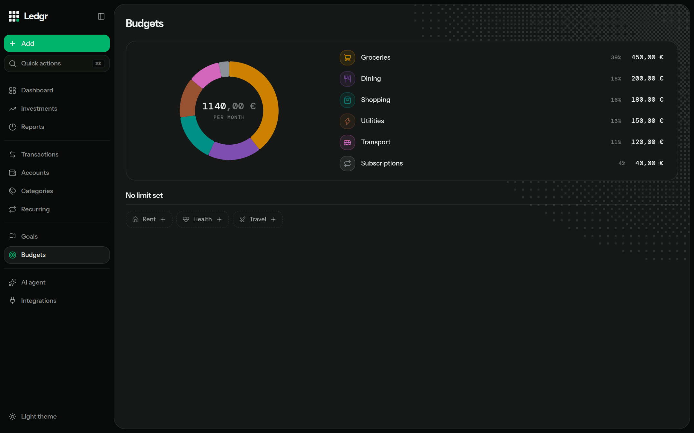

**Accounts**
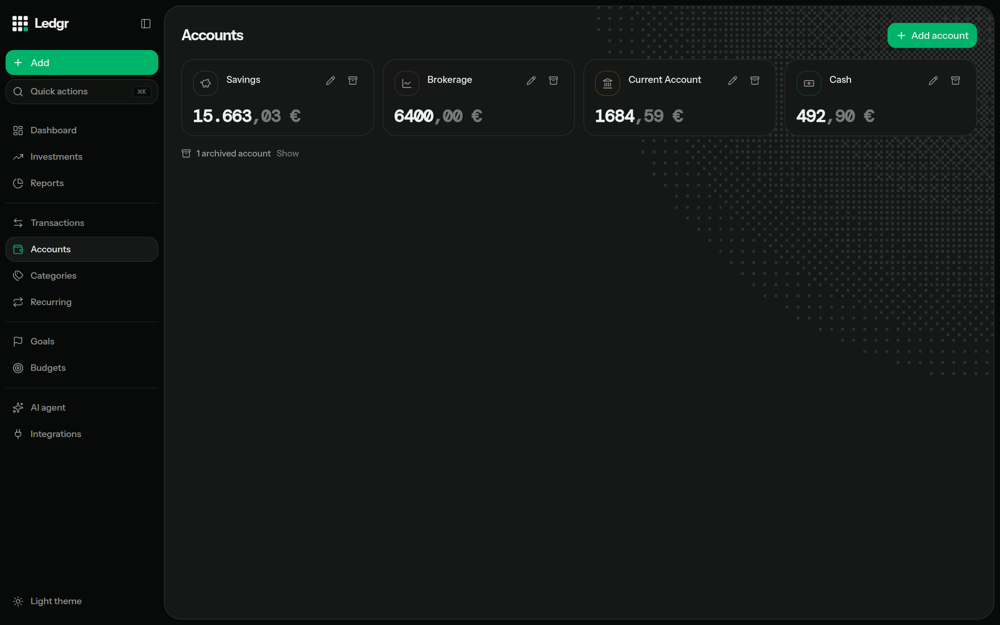

**Light mode, too**
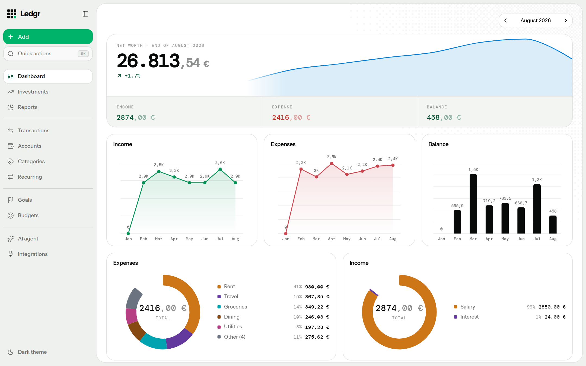

## Stack

- **Hono** on **Cloudflare Workers**, **D1** for storage.
- **React 19**, **TanStack Query** and **TanStack Table**.
- **shadcn/ui** for functional components, **Aceternity UI** for hero and accent moments, **Motion** for transitions.
- **ECharts** for every chart, with an OKLCH-generated, accessibility-validated color palette.
- **zod** schemas shared between server and client, one source of truth for types and validation.

## Getting started

```
git clone https://github.com/bielupc/Ledgr.git
cd Ledgr
npm install
npm run dev             # Worker (:8787) + Vite (:5173) together
npm run db:reset        # wipe local D1, migrate, seed demo data
```

```
npm run build            # tsc -b && vite build
npm run typecheck
npm run lint
npm test                 # vitest, inside the Workers runtime, real D1 binding
```

`npm run db:reset` seeds a full demo dataset: accounts, about 8 months of
transactions, budgets, recurring rules and a synthetic 5-fund investment
portfolio with 14 months of price history. That dataset is what every
screenshot above was taken from.

## Deploy to your own Cloudflare account

Everything below is free tier. You need a Cloudflare account and `wrangler`
logged in (`npx wrangler login`).

1. **Create your own D1 database**: `npx wrangler d1 create ledgr`, then
   paste the `database_id` it prints into `wrangler.toml`, replacing the
   placeholder. Run `git update-index --skip-worktree wrangler.toml`
   afterwards so git stops tracking further local edits to it, your real
   ID never risks getting committed.
2. **Apply the schema**: `npm run db:migrate:remote`.
3. **Deploy the API**: `npm run deploy:api`. Note the `*.workers.dev` URL it
   prints.
4. **Point the frontend at it**: put that URL in `.env.production.local`
   (a new file, gitignored) as `VITE_API_URL=...` — Vite prefers `.local`
   over the committed placeholder in `.env.production` automatically.
5. **Deploy the frontend**: `npm run deploy:web`. The first run creates a
   Cloudflare Pages project named `ledgr` and prints its `*.pages.dev` URL.
6. **Close the loop**: put that Pages URL in `PAGES_ORIGIN` in your local
   `wrangler.toml`, then run `npm run deploy:api` again. This is what the
   Worker checks incoming requests against (`server/index.ts`), so skipping
   it leaves the frontend loading but every API call rejected by CORS.

That's it, deploys from here on are just `npm run deploy:api` /
`npm run deploy:web` whenever you want to push an update. No GitHub Actions,
no repo access needed, this is your own machine talking to your own
Cloudflare account.